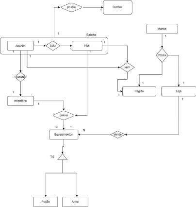

## Histórico de versões

| Versão |    Data    | Descrição                | Autor                                              | Revisão |
| :----: | :--------: | ------------------------ | -------------------------------------------------- | ------- |
| `1.0`  | 23/09/2023 | Criação do documento DER | [Luana Torres](https://github.com/luanatorress) e [Samuel Castro](https://github.com/SamuelCastro7) e [Thiago Vivan](https://github.com/thiago-vivan)|         |
| `1.1`  | 24/09/2023 | Atualização do DER | [Isabella Carneiro](https://github.com/isabellacgmsa) e [Samuel Castro](https://github.com/SamuelCastro7) e [Luana Torres](https://github.com/luanatorress) |         |

# Diagrama Entidade-Relacionamento

Diagrama de Entidade e Relacionamento (DER) é uma representação gráfica do Modelo de Entidade e Relacionamento. O diagrama fornece uma visão lógica do banco de dados, fornecendo um modelo visual da estruturação dos dados de um sistema.

 

 </img>

Figura 1: DER Gods of Battle

Fonte: Autores

