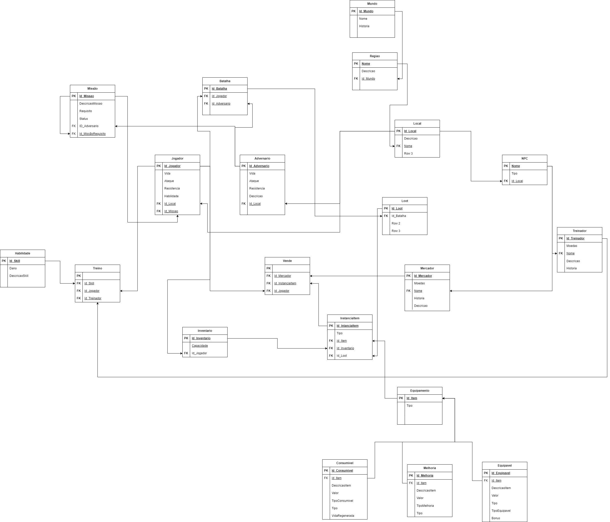

## Histórico de versões

| Versão |    Data    | Descrição                | Autor                                              | Revisão |
| :----: | :--------: | ------------------------ | -------------------------------------------------- | ------- |
| `1.0`  | 02/10/2023 | Criação do documento MREL |  [Thiago Vivan](https://github.com/thiago-vivan) [Isabella Carneiro](https://github.com/isabellacgmsa) |   [Samuel Castro](https://github.com/SamuelCastro7)      |

# Modelo Relacional (MREL)

O Modelo Relacional apresenta um diagrama lógico da forma em que as entidades e seus relacionamentos são mapeados no banco de dados.

## 1. Diagrama

 </img>

Figura 1: MREL Gods of Battle

Fonte: Autores

